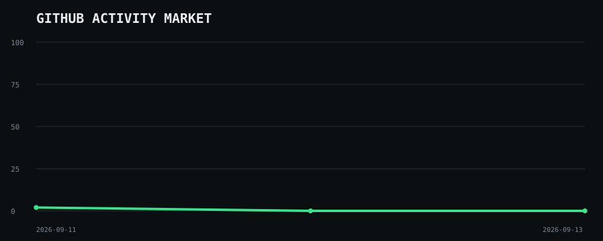
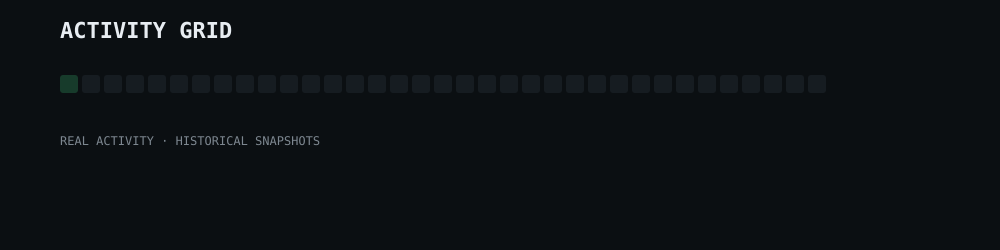

# KRISHNA // CONTROL ROOM

> Personal research laboratory · GitHub analytics terminal · experiment archive

---

## 01 // SYSTEM STATUS

| FIELD | VALUE |
|---|---|
| PRIMARY LANGUAGE | Python |
| SECONDARY | JavaScript · TypeScript · SQL |
| MODE | Research · Build · Experiment |
| DATA SOURCE | GitHub |
| STATUS | ONLINE |

---

## 02 // CURRENT SIGNAL

`FINANCE` · `TECHNOLOGY` · `AI` · `CYBERSECURITY` · `ANALYTICS` · `RESEARCH`

---

## 03 // GITHUB ACTIVITY MARKET

> GitHub activity visualized as a market-style signal.
>
> This is a derived visualization, not a financial market and not an official GitHub metric.



---
## 04 // LIVE METRICS

<!-- METRICS:START -->
| METRIC | VALUE |
|---|---:|
| REPOSITORIES | Updating... |
| ACTIVE REPOSITORIES | Updating... |
| STARS | Updating... |
| FORKS | Updating... |
| RECENT ACTIVITY | Updating... |
| ACTIVITY INDEX | Updating... |
<!-- METRICS:END -->

_Data is generated automatically from GitHub._
---

## 05 // ACTIVITY GRID



---

## 06 // REPOSITORY CONSTELLATION


---

## 07 // ACTIVE LAB

### Growth Graph

**Personal performance analytics system**

- Goals & actuals
- 0–100 Growth Score
- Weekly / monthly / yearly / custom timelines
- Historical data
- Trading-style growth charts
- AI review
- Provider failover architecture
- Local-first data storage

[Open Growth Graph →](#)

---

## 08 // ACTIVITY TIMELINE

Historical GitHub activity collected over time.

```text
SYSTEM
│
├── Historical snapshots
├── Repository activity
├── Commit activity
├── Pull requests
├── Issues
└── Repository events
